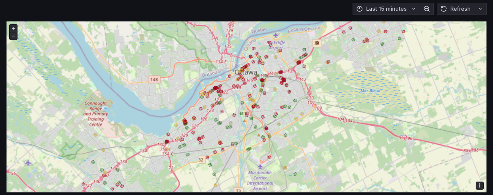

# OC Transpo GTFS-RT Demo

## About

This demo uses bento to query the GTFS-RT feed of OC Transpo, maps the GTFS object to a simple JSON list, and then publishes it to MQTT. Grafana has a live MQTT datasource which will refresh panels when new messages are published. Minor transformations are applied to help Grafana interpret the JSON array and then plot all vehicle positions on a Geomap panel. The colour is based on the speed of the bus and the position and orientation are also from the feed.

## Instructions

1. Add create a `.env` file with your API key
1. Spin up with `docker compose up -d`
1. Navigate to <http://localhost:3000>
1. Hover over a bus icon on the map to see information like speed, position, and the route id
1. Stop with `docker compose down`

## Data License

GTFS-RT data used in this demo comes from OC Transpo and is licensed under the [Open Government License](https://ottawa.ca/en/city-hall/open-transparent-and-accountable-government/open-data#section-7d58affa-59a3-47f2-932d-ccb75000cefc) by the City of Ottawa
